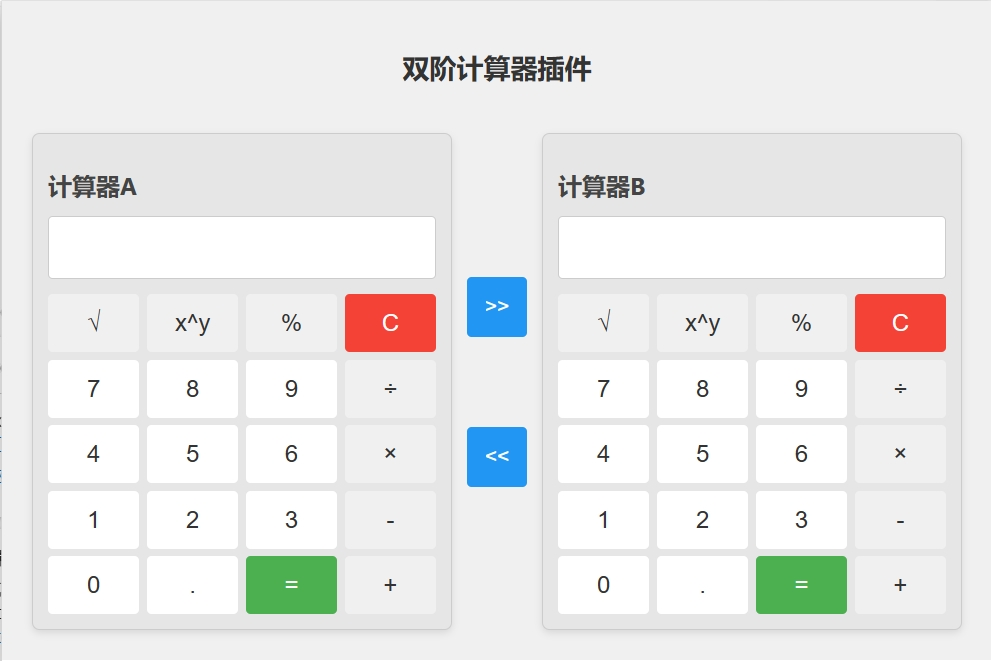

# 双阶计算器插件

## 项目概述11

这是一个为 Edge 浏览器开发的双阶计算器插件。插件提供了两个并排的计算器界面，允许用户进行基本的数学运算，并能在两个计算器之间传输数据。

## 界面预览

## 功能特点

1. 双计算器界面：同时提供两个独立的计算器（计算器A和计算器B）。
2. 基本运算：支持加、减、乘、除等基本运算。
3. 高级运算：支持平方根、幂运算和取模运算。
4. 数据传输：可以在两个计算器之间传输计算结果。
5. 响应式设计：适配不同尺寸的显示器。
6. 视觉反馈：按钮点击时有动画效果。

## 文件结构

- `popup.html`: 插件的主要HTML结构
- `styles.css`: 定义插件的样式
- `popup.js`: 实现计算器的核心逻辑
- `manifest.json`: 定义插件的配置信息
- `icons/`: 存放插件图标

## 使用说明

1. 安装插件后，点击 Edge 浏览器工具栏中的计算器图标打开插件。
2. 使用鼠标点击按钮进行计算操作。
3. 使用 ">>" 按钮将计算器A的结果传输到计算器B。
4. 使用 "<<" 按钮将计算器B的结果传输到计算器A。

## 开发说明

### HTML (popup.html)

主要结构包括两个计算器界面和中间的数据传输按钮。

### CSS (styles.css)

定义了计算器的布局、按钮样式、动画效果等。

### JavaScript (popup.js)

实现了计算器的核心逻辑，包括：
- 数字输入
- 运算符处理
- 计算过程
- 数据传输
- 清除功能

### 清单文件 (manifest.json)

定义了插件的基本信息、权限、图标等。

## 未来改进

1. 添加更多高级数学函数
2. 实现历史记录功能
3. 添加主题切换选项
4. 支持键盘输入 --> 已完成
5. 增加单位转换功能

## 贡献

欢迎提交 Issues 和 Pull Requests 来改进这个项目。
